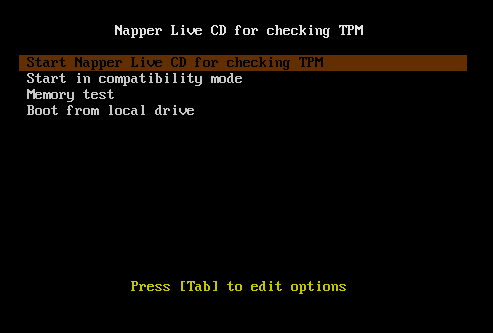
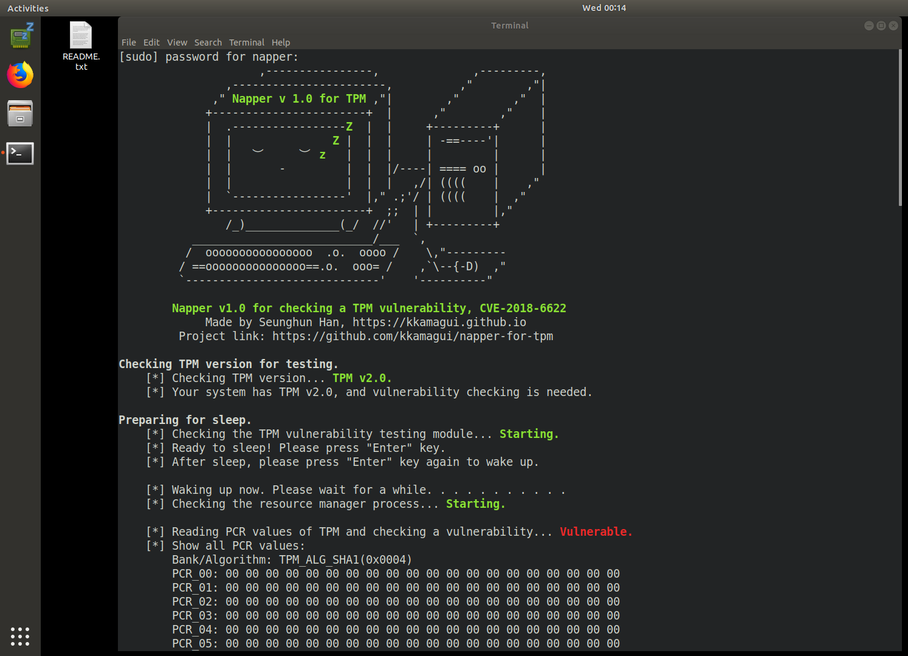
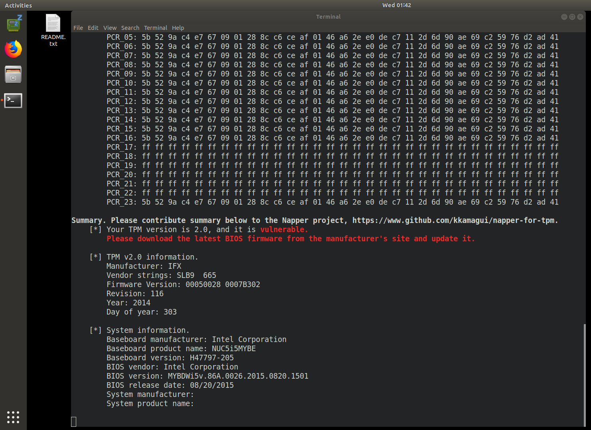

```
                     ,----------------,              ,---------,
                ,-----------------------,          ,"        ,"|
              ," Napper v1.2 for TPM ," |        ,"        ,"  |
             +-----------------------+  |      ,"        ,"    |
             |  .-----------------Z  |  |     +---------+      |
             |  |               Z |  |  |     | -==----'|      |
             |  |   ︶     ︶ z   |  |  |     |         |      |
             |  |       -         |  |  |/----| ==== oo |      |
             |  |                 |  |  |   ,/| ((((    |    ,"
             |  `-----------------'  |," .;'/ | ((((    |  ,"
             +-----------------------+  ;;  | |         |,"     
                /_)______________(_/  //'   | +---------+
           ___________________________/___  `,
          /  oooooooooooooooo  .o.  oooo /    \,"---------
         / ==ooooooooooooooo==.o.  ooo= /    ,`\--{-D)  ,"
         `-----------------------------'    '----------"

        Napper v1.2 for checking a TPM vulnerability, CVE-2018-6622
         Project link: https://github.com/kkamagui/napper-for-tpm 
        Please contribute your summary report to the Napper project!                    
```

# 1. Notice
"Napper" is a new checking tool for a TPM vulnerability, CVE-2018-6622. CVE-2018-6622 is related to S3 sleep or suspend of Advanced Configuration and Power Interface (ACPI). The attacker can subvert the TPM with S3 sleep, and remote attestation and seal/unseal features that use Platform Configuration Registers (PCRs) can be neutralized. If you want the detailed information about CVE-2018-6622, please read our USENIX paper, [A Bad Dream: Subverting Trusted Platform Module While You Are Sleeping](https://www.usenix.org/system/files/conference/usenixsecurity18/sec18-han.pdf).

## 1.1. Presentation and Paper
Napper and CVE-2018-6622 were introduced at security conferences below.
 - [Black Hat Asia 2019: Finally, I Can Sleep Tonight: Catching Sleep Mode Vulnerabilities of the TPM with the Napper](https://www.blackhat.com/asia-19/briefings/schedule/index.html#finally-i-can-sleep-tonight-catching-sleep-mode-vulnerabilities-of-the-tpm-with-the-napper-13588)
 - [USENIX Security 2018: A Bad Dream: Subverting Trusted Platform Module While You Are Sleeping](https://www.usenix.org/system/files/conference/usenixsecurity18/sec18-han.pdf)

You can watch the demo video below.
 - [](https://youtu.be/K3ewNJuRzRM)

## 1.2. Contributions
We always welcome your contributions. Napper's summary report that you contribute will make the world safe.

## 1.3. License
Napper has GPL v2 license.

# 2. Introduce of Napper
Trusted Platform Module (TPM) is a tamper-resistant device and designed to provide hardware-based security functions. A TPM chip has a random number generator, non-volatile storage, encryption/decryption modules, and Platform Configuration Registers (PCRs), which can be utilized for various security applications such as BitLocker, DM-Crypt, Trusted Boot (tboot), and Open Cloud Integrity Technology (Open CIT).

TPM has been widely deployed in commodity devices to provide a strong foundation for building trusted platforms, especially in devices used in enterprise and government systems. Because TPM is the critical point in the trusted platform, many researchers have tried to find vulnerabilities in the TPM and concluded that it is hard to break it without physical access. However, this is not true anymore.

The vulnerabilities we found can subvert the TPM with Advanced Configuration and Power Interface (ACPI). ACPI in PCs, laptops, and servers provide six sleeping states (S0-S5) for reducing power consumption. When the system enters the sleeping state, CPU, device, and RAM are powered off. Since the system powers the components off including security devices, the system should reinitialize them while waking up and this could be the attack surface. We found vulnerabilities on this attack surface without physical access.

To mitigate the vulnerabilities, we also present countermeasures and a new tool, "Napper," to check the vulnerabilities of the TPM. Napper is a bootable USB device based-on Linux, and it has a kernel module and a vulnerability checking software. When you boot a system with the Napper, it makes your system take a nap to check the vulnerabilities and to report the result to you.

# 3. How to Use the "Napper" Tool
Napper consists of a special kernel module and customized tpm2 tools. Napper is based on Ubuntu 18.04, and we customized and tailored it to make a Live CD image. If you just want to check the TPM vulnerability and find an easy way for it, please move to Section 3.1 and use Napper Live CD image with your USB storage. Napper Live CD has not only a binary tool but also full source code of Napper. If you are using Ubuntu 18.04 now and want to build Napper from scratch, please move to Section 3.2 and build it.

## 3.1. Using Your Own USB Storage with Napper Live CD Image (Short Version)
### 3.1.1. Get Napper Live CD Image from Napper Project
Napper Live CD images are in the [release page](https://github.com/kkamagui/napper-for-tpm/releases) of [Napper project](https://github.com/kkamagui/napper-for-tpm).

### 3.1.2. Write Napper Live CD Image to Your USB Storage
If you are using Microsoft Windows operating system, use [Win32 Disk Imager](https://sourceforge.net/projects/win32diskimager/) and write Napper Live CD image to your USB storage.

If you are using Linux or Mac OS X, use a `dd` command below.
```
# Please change sdX to your USB storage name.
$> sudo dd if=Napper-LiveCD.iso of=/dev/sdX bs=4096
$> sync
```

### 3.1.3. Reboot Your System with Your USB Storage and Run Napper
If you plug your USB storage and change a boot sequence to boot with it, you can see Napper's boot menu below and start Napper Live CD by selecting the first option.
<center>  </center>

After the boot sequence, you can see the README.txt file on the desktop and Napper tool icon on the left dock bar. To check your system, please click the top icon of the dock bar and type `napper` for the password. Napper tool's `ID` and `password` are set to `napper`. While Napper tests your system, it will sleep your system and wake up. Therefore, you need to type a keyboard to wake your system up from ACPI S3 sleep state.
<center>  </center>

If your system has a TPM vulnerability, Napper will report a summary that your system is vulnerable below. If so, please move to Section 4 and share the summary to our project, Napper, through [Issue Report of Napper project](https://github.com/kkamagui/napper-for-tpm/issues) or [Website](https://kkamagui.github.io/).
<center>  </center>

## 3.2. Build Napper from Scratch with Ubuntu 18.04 (Long Version)
### 3.2.1. Download Ubuntu 18.04 and Clone Napper Source Code
Napper is based on Ubuntu 18.04. Therefore, you download it from [Official Ubuntu Website](https://www.ubuntu.com/download/desktop) and install it to your target system. After that, you clone Napper source code from the [Napper project site, https://www.github.com/kkamagui/napper-for-tpm](https://www.github.com/kkamagui/napper-for-tpm) and build it with commands below.

```
# Clone Napper source code from project site.
$> git clone https://github.com/kkamagui/napper-for-tpm.git

# Build Napper.
$> cd napper-for-tpm
$> ./bootstrap
```
### 3.2.2. Run Napper with a Terminal
After building the source code, you can run a Napper tool with a terminal. Please type the command below in your terminal. Napper front-end is made of Python script.
```
# Run Napper
$> sudo ./napper.py
                     ,----------------,              ,---------,
                ,-----------------------,          ,"        ,"|
              ," Napper v 1.0 for TPM ,"|        ,"        ,"  |
             +-----------------------+  |      ,"        ,"    |
             |  .-----------------Z  |  |     +---------+      |
             |  |               Z |  |  |     | -==----'|      |
             |  |   ︶     ︶ z   |  |  |     |         |      |
             |  |       -         |  |  |/----| ==== oo |      |
             |  |                 |  |  |   ,/| ((((    |    ,"
             |  `-----------------'  |," .;'/ | ((((    |  ,"
             +-----------------------+  ;;  | |         |,"     
                /_)______________(_/  //'   | +---------+
           ___________________________/___  `,
          /  oooooooooooooooo  .o.  oooo /    \,"---------
         / ==ooooooooooooooo==.o.  ooo= /    ,`\--{-D)  ,"
         `-----------------------------'    '----------"

        Napper v1.0 for checking a TPM vulnerability, CVE-2018-6622
             Made by Seunghun Han, https://kkamagui.github.io
         Project link: https://github.com/kkamagui/napper-for-tpm 

Checking TPM version for testing.
    [*] Checking TPM version... TPM v2.0.
    [*] Your system has TPM v2.0, and vulnerability checking is needed.

Preparing for sleep.
    [*] Checking the TPM vulnerability testing module... Starting.
    [*] Ready to sleep! Please press "Enter" key.
    [*] After sleep, please press "Enter" key again to wake up.

    [*] Waking up now. Please wait for a while. . . . . . . . . . .     
    
    ... omitted ...
```

## 3.3. Test Example
The result below is an example of NUC5i5MYHE model. The system has an old version of BIOS and has CVE-2018-6622.
```
[sudo] password for napper: 
                     ,----------------,              ,---------,
                ,-----------------------,          ,"        ,"|
              ," Napper v 1.0 for TPM ,"|        ,"        ,"  |
             +-----------------------+  |      ,"        ,"    |
             |  .-----------------Z  |  |     +---------+      |
             |  |               Z |  |  |     | -==----'|      |
             |  |   ︶     ︶ z   |  |  |     |         |      |
             |  |       -         |  |  |/----| ==== oo |      |
             |  |                 |  |  |   ,/| ((((    |    ,"
             |  `-----------------'  |," .;'/ | ((((    |  ,"
             +-----------------------+  ;;  | |         |,"     
                /_)______________(_/  //'   | +---------+
           ___________________________/___  `,
          /  oooooooooooooooo  .o.  oooo /    \,"---------
         / ==ooooooooooooooo==.o.  ooo= /    ,`\--{-D)  ,"
         `-----------------------------'    '----------"

        Napper v1.0 for checking a TPM vulnerability, CVE-2018-6622
             Made by Seunghun Han, https://kkamagui.github.io
         Project link: https://github.com/kkamagui/napper-for-tpm 

Checking TPM version for testing.
    [*] Checking TPM version... TPM v2.0.
    [*] Your system has TPM v2.0, and vulnerability checking is needed.

Preparing for sleep.
    [*] Checking the TPM vulnerability testing module... Starting.
    [*] Ready to sleep! Please press "Enter" key.
    [*] After sleep, please press "Enter" key again to wake up.

    [*] Waking up now. Please wait for a while. . . . . . . . . . . 
    [*] Checking the resource manager process... Starting.

    [*] Reading PCR values of TPM and checking a vulnerability... Vulnerable.
    [*] Show all PCR values:         
        Bank/Algorithm: TPM_ALG_SHA1(0x0004)
        PCR_00: 00 00 00 00 00 00 00 00 00 00 00 00 00 00 00 00 00 00 00 00
        PCR_01: 00 00 00 00 00 00 00 00 00 00 00 00 00 00 00 00 00 00 00 00
        PCR_02: 00 00 00 00 00 00 00 00 00 00 00 00 00 00 00 00 00 00 00 00
        PCR_03: 00 00 00 00 00 00 00 00 00 00 00 00 00 00 00 00 00 00 00 00
        PCR_04: 00 00 00 00 00 00 00 00 00 00 00 00 00 00 00 00 00 00 00 00
        PCR_05: 00 00 00 00 00 00 00 00 00 00 00 00 00 00 00 00 00 00 00 00
        PCR_06: 00 00 00 00 00 00 00 00 00 00 00 00 00 00 00 00 00 00 00 00
        PCR_07: 00 00 00 00 00 00 00 00 00 00 00 00 00 00 00 00 00 00 00 00
        PCR_08: 00 00 00 00 00 00 00 00 00 00 00 00 00 00 00 00 00 00 00 00
        PCR_09: 00 00 00 00 00 00 00 00 00 00 00 00 00 00 00 00 00 00 00 00
        PCR_10: 00 00 00 00 00 00 00 00 00 00 00 00 00 00 00 00 00 00 00 00
        PCR_11: 00 00 00 00 00 00 00 00 00 00 00 00 00 00 00 00 00 00 00 00
        PCR_12: 00 00 00 00 00 00 00 00 00 00 00 00 00 00 00 00 00 00 00 00
        PCR_13: 00 00 00 00 00 00 00 00 00 00 00 00 00 00 00 00 00 00 00 00
        PCR_14: 00 00 00 00 00 00 00 00 00 00 00 00 00 00 00 00 00 00 00 00
        PCR_15: 00 00 00 00 00 00 00 00 00 00 00 00 00 00 00 00 00 00 00 00
        PCR_16: 00 00 00 00 00 00 00 00 00 00 00 00 00 00 00 00 00 00 00 00
        PCR_17: ff ff ff ff ff ff ff ff ff ff ff ff ff ff ff ff ff ff ff ff
        PCR_18: ff ff ff ff ff ff ff ff ff ff ff ff ff ff ff ff ff ff ff ff
        PCR_19: ff ff ff ff ff ff ff ff ff ff ff ff ff ff ff ff ff ff ff ff
        PCR_20: ff ff ff ff ff ff ff ff ff ff ff ff ff ff ff ff ff ff ff ff
        PCR_21: ff ff ff ff ff ff ff ff ff ff ff ff ff ff ff ff ff ff ff ff
        PCR_22: ff ff ff ff ff ff ff ff ff ff ff ff ff ff ff ff ff ff ff ff
        PCR_23: 00 00 00 00 00 00 00 00 00 00 00 00 00 00 00 00 00 00 00 00
        
        Bank/Algorithm: TPM_ALG_SHA256(0x000b)
        PCR_00: 00 00 00 00 00 00 00 00 00 00 00 00 00 00 00 00 00 00 00 00 00 00 00 00 00 00 00 00 00 00 00 00
        PCR_01: 00 00 00 00 00 00 00 00 00 00 00 00 00 00 00 00 00 00 00 00 00 00 00 00 00 00 00 00 00 00 00 00
        PCR_02: 00 00 00 00 00 00 00 00 00 00 00 00 00 00 00 00 00 00 00 00 00 00 00 00 00 00 00 00 00 00 00 00
        PCR_03: 00 00 00 00 00 00 00 00 00 00 00 00 00 00 00 00 00 00 00 00 00 00 00 00 00 00 00 00 00 00 00 00
        PCR_04: 00 00 00 00 00 00 00 00 00 00 00 00 00 00 00 00 00 00 00 00 00 00 00 00 00 00 00 00 00 00 00 00
        PCR_05: 00 00 00 00 00 00 00 00 00 00 00 00 00 00 00 00 00 00 00 00 00 00 00 00 00 00 00 00 00 00 00 00
        PCR_06: 00 00 00 00 00 00 00 00 00 00 00 00 00 00 00 00 00 00 00 00 00 00 00 00 00 00 00 00 00 00 00 00
        PCR_07: 00 00 00 00 00 00 00 00 00 00 00 00 00 00 00 00 00 00 00 00 00 00 00 00 00 00 00 00 00 00 00 00
        PCR_08: 00 00 00 00 00 00 00 00 00 00 00 00 00 00 00 00 00 00 00 00 00 00 00 00 00 00 00 00 00 00 00 00
        PCR_09: 00 00 00 00 00 00 00 00 00 00 00 00 00 00 00 00 00 00 00 00 00 00 00 00 00 00 00 00 00 00 00 00
        PCR_10: 00 00 00 00 00 00 00 00 00 00 00 00 00 00 00 00 00 00 00 00 00 00 00 00 00 00 00 00 00 00 00 00
        PCR_11: 00 00 00 00 00 00 00 00 00 00 00 00 00 00 00 00 00 00 00 00 00 00 00 00 00 00 00 00 00 00 00 00
        PCR_12: 00 00 00 00 00 00 00 00 00 00 00 00 00 00 00 00 00 00 00 00 00 00 00 00 00 00 00 00 00 00 00 00
        PCR_13: 00 00 00 00 00 00 00 00 00 00 00 00 00 00 00 00 00 00 00 00 00 00 00 00 00 00 00 00 00 00 00 00
        PCR_14: 00 00 00 00 00 00 00 00 00 00 00 00 00 00 00 00 00 00 00 00 00 00 00 00 00 00 00 00 00 00 00 00
        PCR_15: 00 00 00 00 00 00 00 00 00 00 00 00 00 00 00 00 00 00 00 00 00 00 00 00 00 00 00 00 00 00 00 00
        PCR_16: 00 00 00 00 00 00 00 00 00 00 00 00 00 00 00 00 00 00 00 00 00 00 00 00 00 00 00 00 00 00 00 00
        PCR_17: ff ff ff ff ff ff ff ff ff ff ff ff ff ff ff ff ff ff ff ff ff ff ff ff ff ff ff ff ff ff ff ff
        PCR_18: ff ff ff ff ff ff ff ff ff ff ff ff ff ff ff ff ff ff ff ff ff ff ff ff ff ff ff ff ff ff ff ff
        PCR_19: ff ff ff ff ff ff ff ff ff ff ff ff ff ff ff ff ff ff ff ff ff ff ff ff ff ff ff ff ff ff ff ff
        PCR_20: ff ff ff ff ff ff ff ff ff ff ff ff ff ff ff ff ff ff ff ff ff ff ff ff ff ff ff ff ff ff ff ff
        PCR_21: ff ff ff ff ff ff ff ff ff ff ff ff ff ff ff ff ff ff ff ff ff ff ff ff ff ff ff ff ff ff ff ff
        PCR_22: ff ff ff ff ff ff ff ff ff ff ff ff ff ff ff ff ff ff ff ff ff ff ff ff ff ff ff ff ff ff ff ff
        PCR_23: 00 00 00 00 00 00 00 00 00 00 00 00 00 00 00 00 00 00 00 00 00 00 00 00 00 00 00 00 00 00 00 00

    [*] Extending 0xdeadbeef to all static PCRs.
    [*] Show all PCR values:         
        Bank/Algorithm: TPM_ALG_SHA1(0x0004)
        PCR_00: 7e 96 8a c6 7f 1b 8d 0d 7a 29 58 3b f2 ee 26 d1 1f f1 24 15
        PCR_01: 7e 96 8a c6 7f 1b 8d 0d 7a 29 58 3b f2 ee 26 d1 1f f1 24 15
        PCR_02: 7e 96 8a c6 7f 1b 8d 0d 7a 29 58 3b f2 ee 26 d1 1f f1 24 15
        PCR_03: 7e 96 8a c6 7f 1b 8d 0d 7a 29 58 3b f2 ee 26 d1 1f f1 24 15
        PCR_04: 7e 96 8a c6 7f 1b 8d 0d 7a 29 58 3b f2 ee 26 d1 1f f1 24 15
        PCR_05: 7e 96 8a c6 7f 1b 8d 0d 7a 29 58 3b f2 ee 26 d1 1f f1 24 15
        PCR_06: 7e 96 8a c6 7f 1b 8d 0d 7a 29 58 3b f2 ee 26 d1 1f f1 24 15
        PCR_07: 7e 96 8a c6 7f 1b 8d 0d 7a 29 58 3b f2 ee 26 d1 1f f1 24 15
        PCR_08: 7e 96 8a c6 7f 1b 8d 0d 7a 29 58 3b f2 ee 26 d1 1f f1 24 15
        PCR_09: 7e 96 8a c6 7f 1b 8d 0d 7a 29 58 3b f2 ee 26 d1 1f f1 24 15
        PCR_10: 7e 96 8a c6 7f 1b 8d 0d 7a 29 58 3b f2 ee 26 d1 1f f1 24 15
        PCR_11: 7e 96 8a c6 7f 1b 8d 0d 7a 29 58 3b f2 ee 26 d1 1f f1 24 15
        PCR_12: 7e 96 8a c6 7f 1b 8d 0d 7a 29 58 3b f2 ee 26 d1 1f f1 24 15
        PCR_13: 7e 96 8a c6 7f 1b 8d 0d 7a 29 58 3b f2 ee 26 d1 1f f1 24 15
        PCR_14: 7e 96 8a c6 7f 1b 8d 0d 7a 29 58 3b f2 ee 26 d1 1f f1 24 15
        PCR_15: 7e 96 8a c6 7f 1b 8d 0d 7a 29 58 3b f2 ee 26 d1 1f f1 24 15
        PCR_16: 7e 96 8a c6 7f 1b 8d 0d 7a 29 58 3b f2 ee 26 d1 1f f1 24 15
        PCR_17: ff ff ff ff ff ff ff ff ff ff ff ff ff ff ff ff ff ff ff ff
        PCR_18: ff ff ff ff ff ff ff ff ff ff ff ff ff ff ff ff ff ff ff ff
        PCR_19: ff ff ff ff ff ff ff ff ff ff ff ff ff ff ff ff ff ff ff ff
        PCR_20: ff ff ff ff ff ff ff ff ff ff ff ff ff ff ff ff ff ff ff ff
        PCR_21: ff ff ff ff ff ff ff ff ff ff ff ff ff ff ff ff ff ff ff ff
        PCR_22: ff ff ff ff ff ff ff ff ff ff ff ff ff ff ff ff ff ff ff ff
        PCR_23: 7e 96 8a c6 7f 1b 8d 0d 7a 29 58 3b f2 ee 26 d1 1f f1 24 15
        
        Bank/Algorithm: TPM_ALG_SHA256(0x000b)
        PCR_00: 5b 52 9a c4 e7 67 09 01 28 8c c6 ce af 01 46 a6 2e e0 de c7 11 2d 6d 90 ae 69 c2 59 76 d2 ad 41
        PCR_01: 5b 52 9a c4 e7 67 09 01 28 8c c6 ce af 01 46 a6 2e e0 de c7 11 2d 6d 90 ae 69 c2 59 76 d2 ad 41
        PCR_02: 5b 52 9a c4 e7 67 09 01 28 8c c6 ce af 01 46 a6 2e e0 de c7 11 2d 6d 90 ae 69 c2 59 76 d2 ad 41
        PCR_03: 5b 52 9a c4 e7 67 09 01 28 8c c6 ce af 01 46 a6 2e e0 de c7 11 2d 6d 90 ae 69 c2 59 76 d2 ad 41
        PCR_04: 5b 52 9a c4 e7 67 09 01 28 8c c6 ce af 01 46 a6 2e e0 de c7 11 2d 6d 90 ae 69 c2 59 76 d2 ad 41
        PCR_05: 5b 52 9a c4 e7 67 09 01 28 8c c6 ce af 01 46 a6 2e e0 de c7 11 2d 6d 90 ae 69 c2 59 76 d2 ad 41
        PCR_06: 5b 52 9a c4 e7 67 09 01 28 8c c6 ce af 01 46 a6 2e e0 de c7 11 2d 6d 90 ae 69 c2 59 76 d2 ad 41
        PCR_07: 5b 52 9a c4 e7 67 09 01 28 8c c6 ce af 01 46 a6 2e e0 de c7 11 2d 6d 90 ae 69 c2 59 76 d2 ad 41
        PCR_08: 5b 52 9a c4 e7 67 09 01 28 8c c6 ce af 01 46 a6 2e e0 de c7 11 2d 6d 90 ae 69 c2 59 76 d2 ad 41
        PCR_09: 5b 52 9a c4 e7 67 09 01 28 8c c6 ce af 01 46 a6 2e e0 de c7 11 2d 6d 90 ae 69 c2 59 76 d2 ad 41
        PCR_10: 5b 52 9a c4 e7 67 09 01 28 8c c6 ce af 01 46 a6 2e e0 de c7 11 2d 6d 90 ae 69 c2 59 76 d2 ad 41
        PCR_11: 5b 52 9a c4 e7 67 09 01 28 8c c6 ce af 01 46 a6 2e e0 de c7 11 2d 6d 90 ae 69 c2 59 76 d2 ad 41
        PCR_12: 5b 52 9a c4 e7 67 09 01 28 8c c6 ce af 01 46 a6 2e e0 de c7 11 2d 6d 90 ae 69 c2 59 76 d2 ad 41
        PCR_13: 5b 52 9a c4 e7 67 09 01 28 8c c6 ce af 01 46 a6 2e e0 de c7 11 2d 6d 90 ae 69 c2 59 76 d2 ad 41
        PCR_14: 5b 52 9a c4 e7 67 09 01 28 8c c6 ce af 01 46 a6 2e e0 de c7 11 2d 6d 90 ae 69 c2 59 76 d2 ad 41
        PCR_15: 5b 52 9a c4 e7 67 09 01 28 8c c6 ce af 01 46 a6 2e e0 de c7 11 2d 6d 90 ae 69 c2 59 76 d2 ad 41
        PCR_16: 5b 52 9a c4 e7 67 09 01 28 8c c6 ce af 01 46 a6 2e e0 de c7 11 2d 6d 90 ae 69 c2 59 76 d2 ad 41
        PCR_17: ff ff ff ff ff ff ff ff ff ff ff ff ff ff ff ff ff ff ff ff ff ff ff ff ff ff ff ff ff ff ff ff
        PCR_18: ff ff ff ff ff ff ff ff ff ff ff ff ff ff ff ff ff ff ff ff ff ff ff ff ff ff ff ff ff ff ff ff
        PCR_19: ff ff ff ff ff ff ff ff ff ff ff ff ff ff ff ff ff ff ff ff ff ff ff ff ff ff ff ff ff ff ff ff
        PCR_20: ff ff ff ff ff ff ff ff ff ff ff ff ff ff ff ff ff ff ff ff ff ff ff ff ff ff ff ff ff ff ff ff
        PCR_21: ff ff ff ff ff ff ff ff ff ff ff ff ff ff ff ff ff ff ff ff ff ff ff ff ff ff ff ff ff ff ff ff
        PCR_22: ff ff ff ff ff ff ff ff ff ff ff ff ff ff ff ff ff ff ff ff ff ff ff ff ff ff ff ff ff ff ff ff
        PCR_23: 5b 52 9a c4 e7 67 09 01 28 8c c6 ce af 01 46 a6 2e e0 de c7 11 2d 6d 90 ae 69 c2 59 76 d2 ad 41

Summary. Please contribute summary below to the Napper project, https://www.github.com/kkamagui/napper-for-tpm.
    [*] Your TPM version is 2.0, and it is vulnerable.
        Please download the latest BIOS firmware from the manufacturer's site and update it.

    [*] TPM v2.0 information.
        Manufacturer: IFX
        Vendor strings: SLB9  665   
        Firmware Version: 00050028 0007B302 
        Revision: 116
        Year: 2014
        Day of year: 303

    [*] System information.
        Baseboard manufacturer: Intel Corporation
        Baseboard product name: NUC5i5MYBE
        Baseboard version: H47797-205
        BIOS vendor: Intel Corporation
        BIOS version: MYBDWi5v.86A.0026.2015.0820.1501
        BIOS release date: 08/20/2015
        System manufacturer:                                  
        System product name:                                  
```

# 4. Mitigations
The root cause of CVE-2018-6622 is improper handling of an abnormal S3 sleep case, and you can remove the vulnerability by following two options.
 - **Updating the latest BIOS firmware to your system**: We reported CVE-2018-6622 to major manufacturers such as Intel, Dell, and Lenovo, and they already released new firmware. If you are still vulnerable after updating the latest BIOS, please try the next option below and contribute your summary report.
 - **Disable S3 sleep feature in your BIOS**: Recent BIOS firmware has a feature that disables S3 sleep for several reasons. Therefore, please enter your BIOS setup and disable S3 sleep.

# 5. Contributions
We prepared this section for you. Please feel free to contact us.

 - [Bumblebee](https://twitter.com/luckygiraffe6)
 - [Gwan-gyeong Mun](https://www.facebook.com/gwangyeong.mun.0), researcher at Intel
 - [Juneseok Byun](https://www.facebook.com/byunjuneseok) at Lab, the 2nd brain & the 3rd eye of Hongik University
 - [JaeRyoung Oh](https://twitter.com/h4z3dic), CEO of Blackfort Security, Inc.
 - [Junyoung Jung](https://www.facebook.com/sauber92) at Mobile & Embedded System Lab. of Kyung Hee University
 - Matt Oh
 - [Seong Bin Park](https://github.com/0a777h), anti-cheat engine developer and malware researcher at wellbia.com
 - [Sung Ki Park](https://facebook.com/windowstory), Microsoft MVP in Windows and device for IT
 - [Yonghwan Roh](https://www.facebook.com/yonghwan.noh), CEO of Somma, Inc.

# 6. Test Results
We will update this field with your contributions. We are testing several devices we have and will update the result soon.

| Model               | Status         | BIOS Vendor              | BIOS Version                       | BIOS Release Date (MM/DD/YY) | TPM 2.0 Manufacturer  | Vendor String | TPM Firmware Version | 
| ------------------- | :------------: | ------------------------ | ---------------------------------- | ---------------------------- | --------------------- | ------------- | -------------------- |
| ASUS Q170M-C        | **Vulnerable** | American Megatrends Inc. | 4001                               | 11/09/2018                   | Infineon (IFX)        | SLB9665       | 5.51.8.12800         |
| Dell Optiplex 7040  | **Vulnerable** | Dell                     | 1.11.1                             | 10/10/2018                   | NTC                   | rls NPCT      | 1.3.2.8              |
| Dell Optiplex 7050  | **Vulnerable** | Dell                     | 1.11.0                             | 11/01/2018                   | NTC                   | rls NPCT      | 1.3.2.8              |
| GIGABYTE H170-D3HP  | **Vulnerable** | American Megatrends Inc. | F20g                               | 03/09/2018                   | Infineon (IFX)        | SLB9665       | 5.61.10.57600        |
| GIGABYTE Q170M-MK   | **Vulnerable** | American Megatrends Inc. | F23                                | 04/12/2018                   | Infineon (IFX)        | SLB9665       | 5.51.8.12802         |
| HP Spectre x360     | **Vulnerable** | American Megatrends      | F.24                               | 01/07/2019                   | Infineon (IFX)        | SLB9665       | 5.62.12.13824        |
| Intel NUC5i5MYHE    | **Vulnerable** | Intel                    | MYBDWi5v.86A. 0049.2018. 1107.1046 | 11/07/2018                   | Infineon (IFX)        | SLB9665       | 5.40.7.45826         |
| Lenovo T480 (20L5A00TKR) | **Safe**  | Lenovo                   | N24ET44W (1.19 )                   | 11/07/2018                   | Infineon (IFX)        | SLB9670       | 7.63.14.6400         |
| Lenovo T580         | **Safe**       | Lenovo                   | N27ET20W (1.06 )                   | 01/22/2018                   | STMicroelectronics    |               | 73.4.17568.4452      |
| Microsoft Surface Pro 4 | **Safe**   | Microsoft Corporation    | 108.2439.769                       | 12/07/2018                   | Infineon (IFX)        | SLB9665       | 5.62.12.13826        |
 

# 7. Known Issues
 - Some machines turn off the power of a USB storage while S3 sleep and could not connect it again. In this case, please plug the USB storage into "always powered port" of your system.
 - Ubuntu 18.04 sometimes failed to find a TPM in your system. In this case, please reboot with Napper and try it again.
 - If Secure Boot is enabled, the system cannot boot with the Napper. For testing, please disable the Secure Boot option temporarily.

# 8. TODO
 - Microsoft's devices like Surface Book 2, Surface Pro 6, Surface Laptop 2 are not supported by Ubuntu 18.04 and Kernel 4.18.0-15. Testing is needed after upgrading the kernel.
